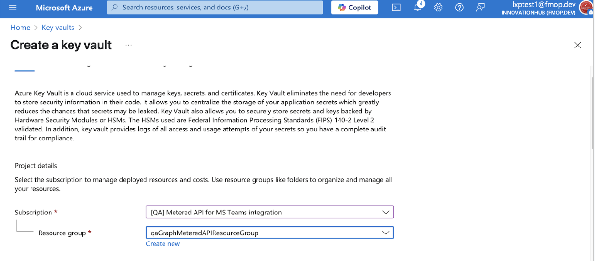
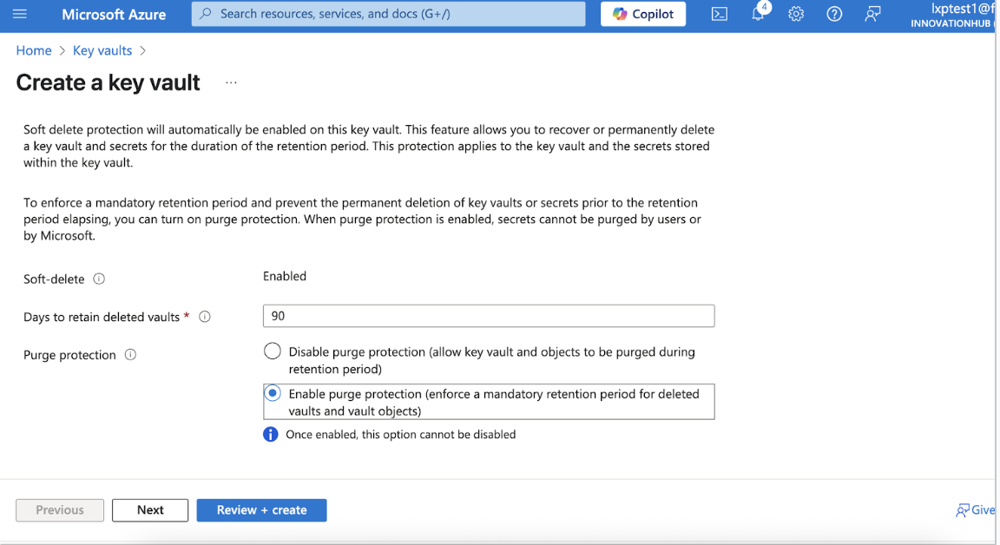
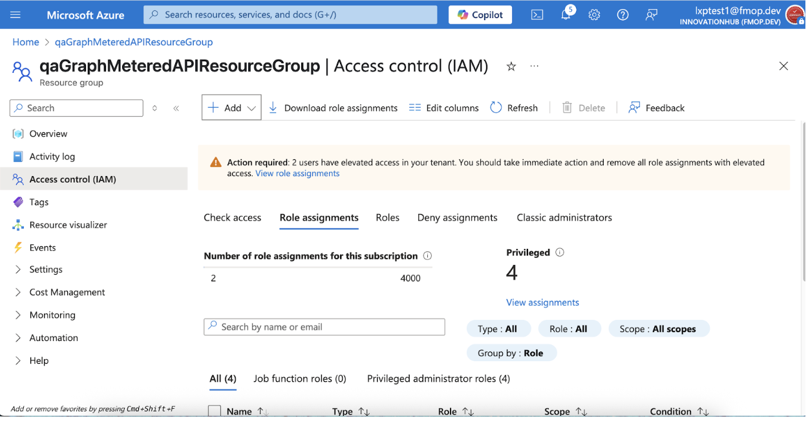
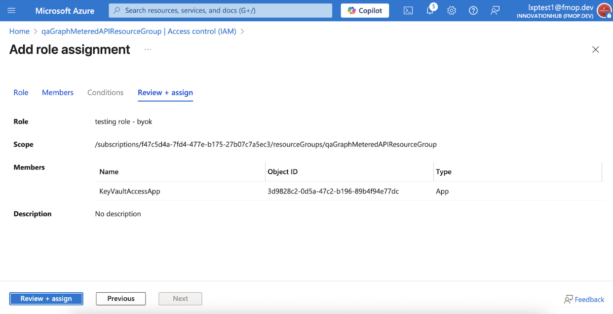

# Step-by-Step Guide: BYOK Integration with Azure Key Vault

The LeapXpert Communications Platform integrates with a customer-managed **Azure Key Vault** for **BYOK (Bring Your Own Key)**, enabling secure encryption and decryption of sensitive communication data.

This guide provides step-by-step instructions for configuring Azure Key Vault, creating a customer-managed key, and integrating it with LeapXpert.

---

## Before you start

- Review the BYOK concept and how it works within the LeapXpert platform. See: **Configure Bring Your Own Key (BYOK) protection** (internal link).
- To enable authentication, understand how to generate certificates from the LeapXpert Admin Portal. See: **Generate certificate credential keys for Microsoft Entra ID app registration** (internal link).
  *The certificate generation step is required before proceeding.*

> **Note**  
> The certificate generation step is required before proceeding to the configuration section below.

---

## Configure BYOK integration with Azure Key Vault

### Create an App Registration in Entra ID (2)

1. Log in to **Microsoft Entra Admin Center**.
2. Go to **App registrations**. 
3. Click **+ New registration**. 
4. Fill in:
   - **Name**: e.g., `KeyVaultAccessApp`
   - **Supported account types**: *Accounts in this organizational directory only* (Single tenant)
   - **Redirect URI**: Leave blank (or set if required by your app)
5. Click **Register**. 
6. Copy the **Application (Client) ID** and **Directory (Tenant) ID** for later use.
7. Go to **Certificates & secrets** and choose **one** of the following:

#### Option 1: Authenticate App using **Certificates** 

- Under **Certificates**, click **Upload certificate** (or **Update certificate**). 
- Click **Select file** and upload the certificate downloaded from the **LeapXpert Org Admin portal**.
- (Optional) Enter a description. 
- Click **Add**.

#### Option 2: Authenticate App using **Client secrets**

- Go to **Certificates & secrets**.
- Click **Client secrets** > **+ New client secret**. 
- Enter a description and select an expiration period. 
- Click **Add**.
- Copy the Value of the secret (you’ll use it for authentication). 

> **Recommendation**  
> Use **Option 1 (Certificates)** to authenticate the App Registration.

---

### Create an Azure Key Vault

1. Log in to the **Azure Portal**.
2. Select **Key vaults**. 
3. Click **+ Create**. 
4. Fill in the required details:
   - **Subscription**: Choose your subscription.
   - **Resource Group**: Select or **Create new**. 
   - **Key Vault Name**: e.g., `leapvault01` (must be globally unique). 
   - **Region**: Select your region.
5. **Enable Soft-delete and Purge Protection**:
   - **Soft Delete**: Ensure it is enabled. This ensures deleted keys can be recovered within the retention period.
   - **Retention Period**: 90 days (default).
   - **Purge Protection**: Enable purge protection to prevent permanent deletion before the retention period ends. 
6. Click **Review + Create**, then **Create**.

> **Note**  
>  To prevent data loss, enable soft delete (90-day retention) and purge protection in Azure Key Vault. This ensures customer-managed keys can be recovered if deleted, maintaining secure and uninterrupted access to encrypted data in LeapXpert.

---

### Create a custom role for Key Vault operations

1. In the **Azure Portal**, navigate to the **Resource Group** that contains your Key Vault. 
2. Click **Access control (IAM)**.
3. Click **Add**. 
4. Click  **Add custom role**. 
5. Enter a **Custom role name** and select **Start from scratch**. 
6. Open the **Permissions** tab and click **Add permissions**. 
7. Search for the following permissions and add them:
   - `Microsoft.KeyVault/vaults/keys/read` *(Actions)* 
   - Click **Add**. 
   - Under **Data actions**, repeat the above steps to those permissions:
     - `Microsoft.KeyVault/vaults/keys/read`
     - `Microsoft.KeyVault/vaults/keys/encrypt/action`
     - `Microsoft.KeyVault/vaults/keys/decrypt/action`
8. Click **Review + create**, then **Create**.

---

### Create role assignment to Key Vault

1. In your Key Vault, go to **Access control (IAM)**. 
2. Select **Role assignments**. 
3. Click **+ Add** > **Add role assignment**. 
4. In **Role**, select the **custom role** you created. 
5. Click **Next**.
6. In the **Members** field, next to **Assign access to**, select **User, group, or service principal**. 
7. Click **+ Select members** and choose the **App Registration** you created earlier (2). 
8. Click **Select**. 
9. Click **Next**.  
10. Click **Review + assign**.

---

### Create a Key

1. In **Azure Portal** > **Key vaults**, select your Key Vault. 
2. In the left navigation, go to **Objects** > **Keys**. 
3. Click **+ Generate/Import**. 
4. Select **Generate** from the dropdown list. 
5. Enter a **Key name**.  
6. Configure:
   - **Key type**: `RSA`.
   - **Key size**: `4096` *(recommended)*.
   - **Activation/Expiration dates**: Optional.
7. Click **Create**.
8. Copy the **Key Identifier (URI)** in the format:
   `https://<key-vault-name>.vault.azure.net/keys/<key-name>/<key-version>`

### Configure in the LeapXpert Org Admin portal

**Private Link** is a secure, private connection that keeps your data exchange with LeapXpert entirely within Microsoft’s network (not over the public internet).

#### Option A — Without Private Link

**Summary of required values** (prepare these for configuration in LeapXpert):

| Attribute           | Value                                               |
|---------------------|-----------------------------------------------------|
| Key Name            | `<my-encryption-key>`                               |
| Key Vault URI       | `https://<key-vault-name>.vault.azure.net`          |
| App Registration ID | `<Application (Client) ID>`                         |
| Tenant ID           | `<Directory (Tenant) ID>`                           |
| Client Secret       | `<Client Secret Value>` *(Optional, if using secret)* |

**Configure in LeapXpert:**

1. Log in to the **LeapXpert Org Admin portal**.
2. Go to **Provisioning > Security & Access > Encryption**. 
3. Click **+ Create New Key**.
4. In **Create a customer managed key**, enter **Name** and (optional) **Description**. 
5. Select **Azure Key Vault** and fill in:
   - **Key name**
   - **Vault URL**
   - **Tenant ID**
   - **Client ID**
   - **Credential type**: *Secret* or *Certificate*
6. Click **Create**.
7. Click **Enable BYOK** (top right).

---

#### Option B — Connect to customer Azure tenant with **Private Link**

1. Run the following in **Azure CLI**:

   ```bash
   az keyvault list --query "[].{Name:name, ResourceID:id, Subscription:subscriptionId, Region:location}" -o table.
2. Write down required values from the Azure CLI output or from your Azure Portal, collect the following:

- **Key Vault Name**: `<key-vault-name>`  
- **Key Vault Key Name**: `<key-name>`  
- **Key Vault URI**: `https://<key-vault-name>.vault.azure.net/`  
- **Resource Path** (long Azure path):  
  `/subscriptions/<subscription-id>/resourceGroups/<resource-group-name>/providers/Microsoft.KeyVault/vaults/<key-vault-name>`  
- **Subscription ID**: `<subscription-id>`  

3. Collect App Registration details

- **Tenant ID**  
- **Application (Client) ID**  
- **Client Secret** *(if you’re using a password to connect — optional if using certificate)*  

4. Send the information from steps (1) and (2) to **LeapXpert**.  
LeapXpert will use this information to initiate the **Private Link connection**.
5. Once LeapXpert finishes the process, log in to your **Azure Portal**.  
   - Go to your **Key Vault**.  
   - Under **Settings**, click **Networking**.  
   - Choose **Private Endpoint Connections**.  
   - You will see a **pending request** from LeapXpert.  
   - Click it and **approve the request**.  

> **Note**  
> Make sure the status becomes **Approved** (both in your Azure Portal and in LeapXpert).

6. After the link is approved, you will get a few final values to configure on LeapXpert’s Org Admin portal.

| Attribute           | Example                                                        |
|---------------------|----------------------------------------------------------------|
| Key Name            | `encryption-key-1`                                             |
| Key Vault URL       | `https://my-keyvault-prod.privatelink.vaultcore.azure.net`     |
| App Registration ID | `<Application (Client) ID>`                                    |
| Tenant ID           | `<Directory (Tenant) ID>`                                      |
| Client Secret       | *(Optional, if you’re using it)*                               |

7. Log in to the **LeapXpert Org Admin portal**.  
1. Go to **Provisioning > Security & Access > Encryption**.  
2. Click **+ Create New Key**.  
3. Select **Azure Key Vault** and fill in the values from the table above.  
4. Click **Create**.  
5. Click **Enable BYOK**.  

✅ You have successfully configured the **BYOK integration with Azure Key Vault**.


