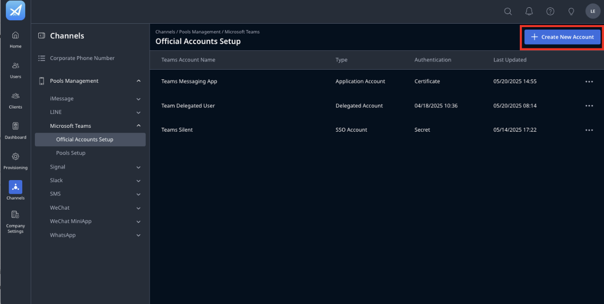

# Enable automatic replies when Users are out of office

Starting from version 2.6.1, you can configure automatic replies in Teams to be sent during a specified time range when AM users are out of office.
This document provides detailed instructions on how to set up this configuration.

## Before you start

Ensure the following prerequisites are met:
- You are using LeapXpert version 2.6.1 or later.
- You have Company Admin permissions to manage Feature Configurations.
- Automatic replies are sent based on the AM user’s timezone, regardless of the client’s timezone.
- Go to the Org Admin portal, check if the Application account has been added to the Official Account Setup. 
- You have the App Registration available on the Azure portal and ensure the Application permission: **MailboxSettings.Read** has been added to the app. Ensure the Messaging App on Azure is the App registration for Messaging and File Transfer. 

> **Note:** If the Application account has not been created in the Org Admin portal, follow the steps below to configure it. If the account already exists, skip ahead to the **Enable automatic replies when users are out of the office** section.

---

## Create a new Messaging App in the Org Admin portal

### On the Azure portal:
- You can generate certificate credentials in the Organization Admin. Follow the instruction in this document: *Generate certificate credential keys for Microsoft Entra ID app registration*.
- Once done, upload the downloaded PEM file to the Teams Messaging & File Transfer application. You can refer to this Microsoft document for further instructions: *Import a certificate to Microsoft Entra ID app registration*. 
- Go to App Registration, collect the following values:
  - Client ID.
  - Tenant ID. 

### On the Org Admin portal:
- Go to Org Admin, select **Channels > Pools Management > Microsoft Teams > Official Accounts Setup > + Create New Account**. 

- Select Application Account and type the Teams Account Name. 
- Paste the client ID, tenant ID values to the Org Admin. 
- Click **Create**.

Authenticate this Application Account by doing the following:
- In the Official Account Setup tab, click **More (...)**.
- Then click **Authenticate**. 
- If you use certificate credentials for Teams authentication, you can also select the certificate credentials from the dropdown list or Generate a new key pair. 
- Once done, click **Save**.

Assign the Application Account to the existing pool created for the Delegated account:
- Go to **Channels > Pools Management > Pools Setup**.
- Click **Edit**.
- Select the Application Account from the dropdown.  
- Click **Next**.
- Double-check the OU > click **Continue**.

---

## Enable automatic replies when Users are out of the office

### Enable on Microsoft Outlook
1. In Microsoft Outlook, click the **Settings** icon.   
2. Select **Account > Automatic replies**.  
3. Toggle the **Automatic replies on** to **ON**.  
4. Check **Send replies only during a time period** and select the time range.
5. Enter the message content of the automatic reply for both:
   - People inside your organization.
   - People outside your organization.   

You have successfully enabled the automatic replies in Microsoft Outlook.

---

### Enable on the Org Admin portal

To enable automatic replies on the Org Admin portal, do as follows:
1. Sign in to the Organization Admin portal.
2. Go to **Company Settings > Feature Configurations > General**.
3. Search **"Automatic replies sync"**.   
4. Click **Edit**. 
5. Click on **Custom value** to turn the value to **ON**.   
6. Once done, click **Save**.

You have successfully enabled the automatic replies on the Org Admin portal.

>**Note:** 
>- The configuration will base on the timezone of the Microsoft setting to send the automatic replies.
>- If the content includes the text warned by the DLP policies, the message will still be sent.
>- If the content includes the text blocked by the DLP policies, the message is blocked.
> - For more information about the DLP, see *What is Data Leakage Prevention?*

---

### Enable on the Teams app

To enable the automatic replies on the Teams app, do as follows:
1. Go to the **Leap Work for Teams app**.
2. Go to **Profile > Settings**. 
3. In the **Automatic replies**, select **Edit**. 
4. Toggle to **ON**, then click **Save**. 

---

## How the feature works

When setting a time range for automatic replies, the system uses the AM user’s time zone to determine when replies should be sent.

For example, if you configure the time range from **11:30 AM on May 5, 2025 to 1:00 PM on May 6, 2025 (GMT+8)**:
- Any client message received within that time range (based on GMT+8) will trigger the automatic reply.
- The LeapXpert system will automatically convert time zones as needed to ensure replies are delivered at the correct time, regardless of the client’s location.
- Once an automatic reply has been sent for a specific time range and message content, the system will not send the same reply again, even if the client sends more messages during that period.
- However, if you update the time range (e.g., change the end time to **11:30 AM on May 6, 2025 (GMT+8)**) or modify the message content, the system will recognize it as a new configuration and send the automatic reply again the next time the client sends a message.

For group chats containing more than 1 user (X Users with automatic replies set up), the client will receive **X automatic replies** in their channel.
