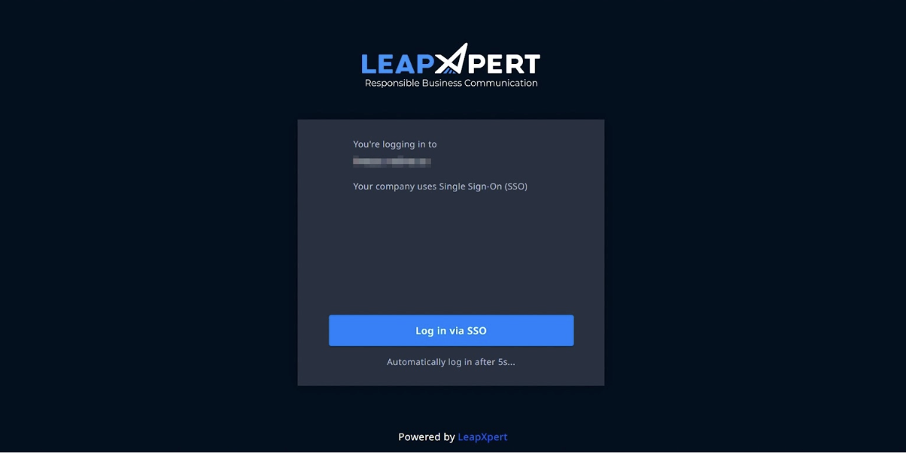

# Self-Onboarding iMessage Native for Managed Apple ID with Okta (Email and Password and Okta Verify Push authentication method)

With LeapXpert platform, admins can send email instructions directly to assigned Users to help them self-onboard their iMessage accounts for message archiving.  
From version 2.3.2 onwards, users who use Managed Apple ID federated with Okta can self-onboard iMessage accounts. Users can verify their accounts with two authentication methods:
- Password only  
- Password and Okta Verify - Push notification  

This guide explains how to self-onboard with Okta using email, password, without the need to use Okta Verify app.  
For self-onboarding with Okta using email, and password only, see **Self-Onboarding iMessage Native for Managed Apple ID with Okta (Email and Password Only authentication method)** (internal link).

**Important:**
- Admins cannot access the Mac that has been issued to users for self-onboarding.  
- Admins can no longer activate iMessage native on behalf of users who are assigned to self-onboard. To learn more about onboarding iMessage Native on-behalf of users, see: *Configure iMessage Native integration in Organization Admin on the OS level.*

---

## Before you start

### For admins
- Ensure the Managed Apple ID login authentication methods are supported.
- Have following permissions:
  - View list of corporate phone number provisionings.
  - Edit corporate phone number provisioning.
  - Activate user’s messaging identities (AM users & admins).
  - Deactivate user’s messaging identity (AM users & admins).
- Request Mac machines set up exclusively for self-onboarding.
- Enable iMessage Native self-onboarding on the Org Admin portal (`Company Settings > Feature Configurations > com.leapxpert.imessage_native.self-onboarding`).

### For AM users
- Double-check Apple ID details.
- Set up iCloud for Messages, Keychain and Contacts. For more information, check *Prepare your iPhone and iMessage account: A step-by-step guide*.
- Use desktop browser for self-onboarding (highly recommended). 

> **Note:** Those practices ensure a frictionless self-onboarding process.

---

## Send email instructions to iMessage users (For admins)

To send email instructions to iMessage Users, do as follows:
1. Sign in to the Organization Admin portal.
2. Go to **Channels > Corporate Phone Number**.
3. Click **Add Phone Number**. In the *Create Corporate Phone Number Provisioning* dialog, fill in the following information:
   - **Phone Number:** input a phone number.
   - **Provisioned User:** search for the company employee's username to whom you want to assign the input phone number.
4. Once done, click **Save**. A new corporate phone number is created.
5. In the newly created corporate phone number, select **View Integrations**.
6. In the *Corporate Phone Number Integration* dialog, select **Email Instruction** in iOS SMS & iMessage Native to start the integration.
7. A confirmation dialog opens. Make sure the email is correct, then click **Send email**.

You have successfully sent an instruction email to users. The email instruction contains a link that allows users to onboard themselves in iMessage Native.  

**Note:** The link typically expires two days after the email is sent.

You can configure different variables of the invitation email template:
- **Company name:** retrieve from the company's display name. You can configure the company name in the invitation email by editing the Display Name in the company profile. See: *Edit the company profile information*.
- **Signature logo:** retrieve from the company's primary logo. You can configure the company name in the invitation email by editing the Primary logo in the company profile.  See: *Edit the company logo*.

To customize the invitation email template, contact the LeapXpert support team for further assistance.

Once the user has successfully linked their iMessage account, you can see the iMessage linked status in the Organization Admin.

---

## Self-onboarding process (for AM users)

1. Sign in to iMessage with your Apple account.
2. Once received the email instruction (screenshot), click **Preparations before linking iMessage account** to access a guide for next steps.
3. Once the users have gone through the information on this page, close it and get back to the instruction email.
4. Click **Link Your iMessage Account** button to get started.
5. Enter the 6-digit code sent to the above phone number via SMS to verify your phone number.

>**Note:** From the version 2.3.0 onwards, users can receive OTP via email. To enable sending OTP via email, admins go to `Company Settings > Feature Configurations > Native Channels`. Search for the *"Authentication method for iMessage Native: AM self-onboarding"*, select **Edit**, choose **Send OTP via Email** from the dropdown list. Click **Save**.

6. Select **Log in via SSO** to authenticate your account if your company has enabled SSO authentication. To enable the SSO authentication, see *Enable SSO authentication for iMessage Native self-onboarding* (internal link). 
7. Enter the Apple ID credentials to your iMessage account. 
8. After successfully submitting your Apple ID email and password, check your Okta Verify app and **Approve** the login request. 
9. You will be asked for your Apple device unlock passcode as part of the Apple safety protections. Enter the passcode and complete this process. 
10. Wait for a few minutes so that we can complete the setup on LeapXpert archiving device.
11. You will be prompted to **Turn on Text Message Forwarding** for LeapXpert archiving device. 

>From LeapXpert version 2.6.0 onwards, the **Complete** button can be disabled in a specified period of time based on the configuration.
>- To configure this, admins go to `Company Settings > Feature Configurations` > search *"Set countdown timer for the Complete button"*. The acceptable value range is from 0 to 90 (seconds). 

 
  

12. At this step, on your own device, you encounter the *"Device Added to Your Account"* popup.  
    - This is Apple safety feature when your account is used on other devices. Tap **OK** to dismiss this popup. 
    - If you want to understand more about this Apple mechanism, tap **Settings** to review the list of signed in devices. For more information, see also [*Check your Apple Account device list to find where you're signed in*](https://support.apple.com/en-vn/102649).

    >**Note:** Do not remove the LeapXpert archiving machine from the list since it will unlink you from the iMessage Native. You need to integrate again to resume the message archiving.

13. Below screenshots will show you how to enable **Text Message Forwarding** for LeapXpert capturing device from your iPhone:  
    > **Note:** If you're not seeing Text Message Forwarding option, try turning off the iMessage toggle and then turning it back on again. Wait for a few seconds for Apple to reactivate iMessage, and the Text Message Forwarding option should appear.

14. Apple will ask for a 6-digit code to confirm this action: 
- In less than a minute, you will see the code on the self-onboarding webpage as following. 
- As soon as you see the code, enter it on your iPhone and tap **Allow** to complete this action.
- It may take you a few minutes to see the code. If you don't see the code after 1 minute, tap **Cancel** on your iPhone and try to enable Text Message Forwarding again.

- After you've enabled Text Message Forwarding for the LeapXpert capturing device, click the **Complete** button on the self-onboarding webpage to finish linking your iMessage account. This will let us know you've completed the necessary steps and allow us to prepare for the next user who needs to link their iMessage account.
- If you do not receive the 6-digit code, from version 2.4.0 onwards, we allow users to enable Text Message Forwarding after self-onboarding. For more details, see *Enable Text Message Forwarding after an unsuccessful attempt to onboard to iMessage Native* (internal link).

---

## Unlink iMessage users

The admin can proactively unlink iMessage users in Organization Admin.

To unlink the corporate phone number for iMessage users, do as follows:
1. Sign in to the Organization Admin portal.
2. Go to **Channels > Corporate Phone Number**.
3. Click **View integrations** at the corporate phone number you want to unlink iMessage Native integration.
4. The *Corporate Phone Number Integration* dialog opens, click **Unlink**. 
5. The *Unlink iOS SMS and iMessage native* dialog opens, click **Unlink** to confirm the deactivating process.

From LeapXpert version 2.1.0 onwards, you can unlink iMessage in two ways:
- **Safe Unlink:** To fully capture the pending messages, it may take up to 3 rotations to safely unlink the selected corporate phone number.
- **Fast Unlink:** Upon clicking Unlink, the system implements immediate unlink for the selected corporate phone number. After unlinking, please wait at least 10 minutes before trying to re-link iMessage channel.

>**Note:** Pending unlink request cannot be canceled.

Upon receiving the unlink request, the system will proceed to perform the unlink for the selected Corporate Phone Number. Once done, the iMessage integration status is marked *Unlink by admin* on both the Corporate Phone Number page and Health check report.

From User's iPhone:
- Open **Settings > Apple ID**.
- Scroll down to the bottom of Apple ID settings, and select LeapXpert capturing device.
- Tap **Remove from Account** to remove LeapXpert capturing device from the Apple ID account. 

From version 2.4.0 onwards, the system will automatically conduct the clean up process. For other versions, you need to submit a ticket for the LeapXpert team to wipe data on the capturing device.

>**Note:** Instead of submitting a ticket for every unlinked users, admins can gather the information to submit a list of multiple unlinked users that need to be cleaned.

---

## Limitation

If an unlink from agent event occurs during the safe unlink process, the unlink status will be marked as *Schedule Unlink* with the *Unlink from Agent* unlink reason on both the Corporate Phone Number page and the Health check report. For more information about the unlink behavior, see *iMessage Self-onboarding - Most encountered issues and resolutions* (internal link).
