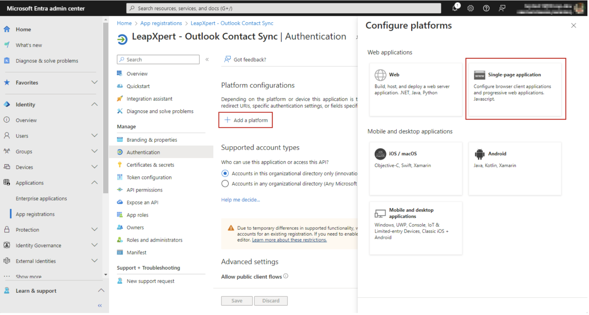

# Sync Contacts from Outlook

LeapXpert introduces the Microsoft Outlook contact import to help companies reduce redundant efforts when trying
to manually re-create the contacts list on LeapXpert platform.  
This article explains how this feature works and provides a detailed instruction to help you sync and manage contact from Microsoft Outlook.  

For this feature, users can import the following details:
- First name & Last name.
- Phone number.  
  Retrieve 1 value from the following priority:
  - Mobile phone number.
  - If no mobile phone, use the first business phone.
  - If no mobile phone, use the first home phone.
- Email address. (If there are many email addresses, take the first one).
- ID.

---

## Before you start
- You are using the LeapXpert version 2.4.0 onwards.
- Your company manages contacts on Outlook.
- Ensure that you enable the following settings on the Org Admin portal: 

  Ensure you select following permissions:
  - **Admin -Contact Synchronization (Administrative permission)** -> for admins. 
  - **Request contact sync from Outlook (Functional permissions > Clients)** -> for AM users. 

- Be aware that initially LeapXpert only supports the integration for the company level, not the business unit level since different regions have different Outlook integration.
> **Note:** Please note that for version 2.4.0, we only support this feature for Governed clients using Microsoft Teams.

---

## How it works
LeapXpert offers two methods to sync contacts from Outlook:
- **Scheduled import**: The user sets automatic sync hourly, every X (hours) or daily upon their preference.  
  >**Note:** LeapXpert temporarily does not support this method.
- **Ad-hoc import**: The user requests to sync when necessary.  

If allowed by the company, the user can request LeapXpert to import their own Outlook contacts at their discretion. Upon the initial import, the user needs to grant LeapXpert the permission to read their Outlook contacts. Such authorization token has an expiry, so once it is expired, the user must grant it again in their next sync request.

The import logic is described as below: 
- When the user imports a list of contact to LeapXpert, those contacts are considered as **New Contact**.
- When the user changes the contact's phone number or email address, in the next import, those contacts are considered as **Updated Contact**.  
  Note that LeapXpert will not consider the following cases as Updated:
  - The previous phone number or email address is used to integrate channels.
  - The change is an empty phone number or email address. This helps prevent the data loss.
- When the user deletes a contact on Outlook, in the next import, those contacts are considered as **Deleted Contact**.  
>**Note:**
>- Although client profiles are deleted, they remain active on LeapXpert. We have an internal method to track those external deletion actions.
>- Temporarily for 2.4.0 version, LeapXpert does not handle the Updated and Deleted Contact types.

---

## Sync contacts from Outlook: Step-by-step guide
### Create an Azure application on the Azure admin portal (For admins)
1. Log in to [https://portal.azure.com/](https://portal.azure.com/)
2. Search for "App Registrations" on the search bar
3. Select **+New Registration**
4. Fill in the name and select "Accounts in this organizational directory only"
5. Click **Register**.  

>**Note:** Do not enter Redirect URI yet.

6. After the app is created, go to **Manage > Authentication > Platform configurations > Add a platform > Single-page application**.   
7. Enter value `{WEB_URL}/teams-outlook-login` for Direct URIs.    
   *Please note that `{WEB_URL}` is the Leap Work  URL of the deployed environment. After entering the value, save the change.*
8. In the **Manage** dropdown, select **API permissions**.
9. Select **Microsoft Graph (1) > Delegated permissions**.
10. On the Select permissions search bar, type "contacts".
11. Tick **Contacts.Read** and click **Add permissions**.   
12. In the **Overview** section, get the Application (Client ID) and Directory (tenant) ID of this application, which will be used for the next step to configure the integration with LeapXpert.   

---

### Set up the integration on LeapXpert Org Admin portal (For admins)
1. From the Org Admin portal, go to **Company Settings > Contact Synchronization > Outlook Integration**.   
2. Click **Add integration**
3. Fill in the name and Application ID and Directory ID collected from the Azure admin portal.  
4. Click **Add**.

---

### Sync contacts on Leap Work for Teams (For AM users)
1. From Leap Work for Teams, AM users who can request ad hoc sync can see the **Outlook Sync** button.  
2. For the first sync, users need to log in with the account they use to log in Microsoft Teams.   
   >**Note:** This step is to authenticate users.
3. There is a prompt asking you to authorize the Azure app to read Outlook contacts.
4. Once authorized, LeapXpert starts the sync process.   
5. After clicking the sync button, it is essential to wait for few minutes to have all contacts imported. Users can switch tab or reload the app to see newly added contacts.

The details of a specific client profile is provided to AM users.   

You have successfully synced contacts from Outlook to Leap Work for Teams.

---

### Sync contacts on Leap Work web (For AM users)
From version 2.6.1 onwards, users can sync contacts from Outlook to Leap Work web and Leap Work mobile as needed (ad-hoc sync).  

To sync Outlook contacts to Leap Work web, do as follows:
1. Go to **Leap Work web > Contacts**.
2. Click the **Sync** button.   
3. Once the sync process is done, you will receive a notification about a total number of contacts synced.   
>**Note:** If this is your first time syncing, all contacts will be imported. For later syncs, only contacts that have been added or updated since the last sync to when you click the button will be retrieved.

---

### Sync contacts on Leap Work mobile (For AM users)
To sync Outlook contacts to Leap Work web, do as follows:
1. Go to **Leap Work mobile > Contacts**.
2. Click the **Sync** button. 
3. Once the sync process is done, you will receive a notification about a total number of contacts synced.
