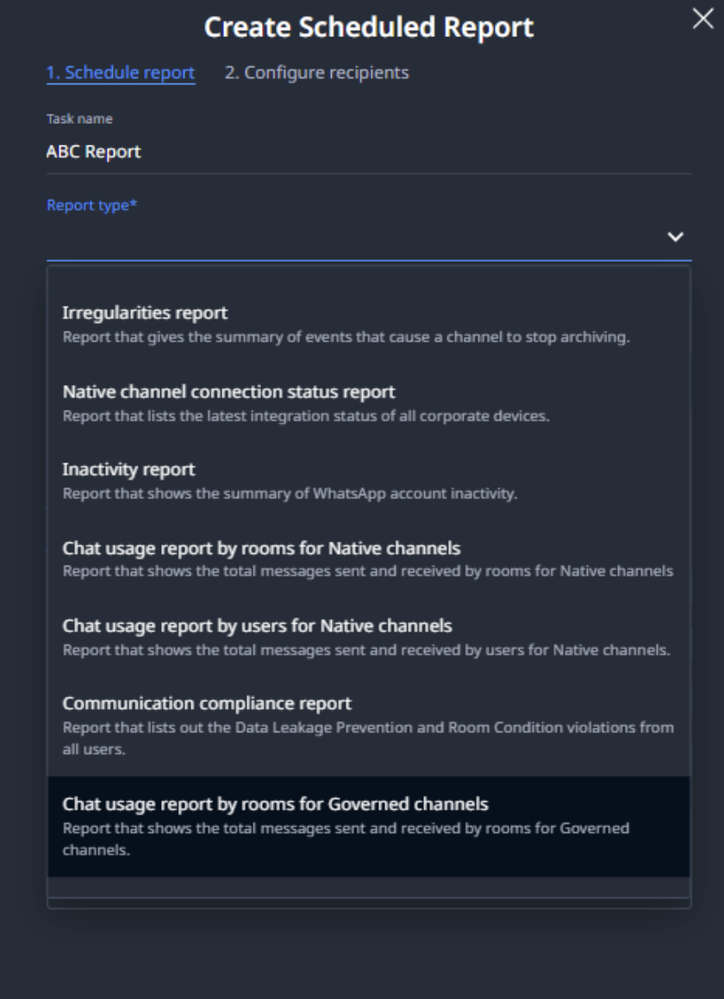
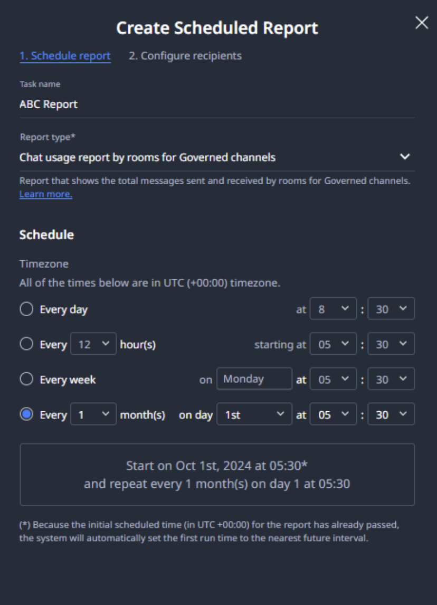
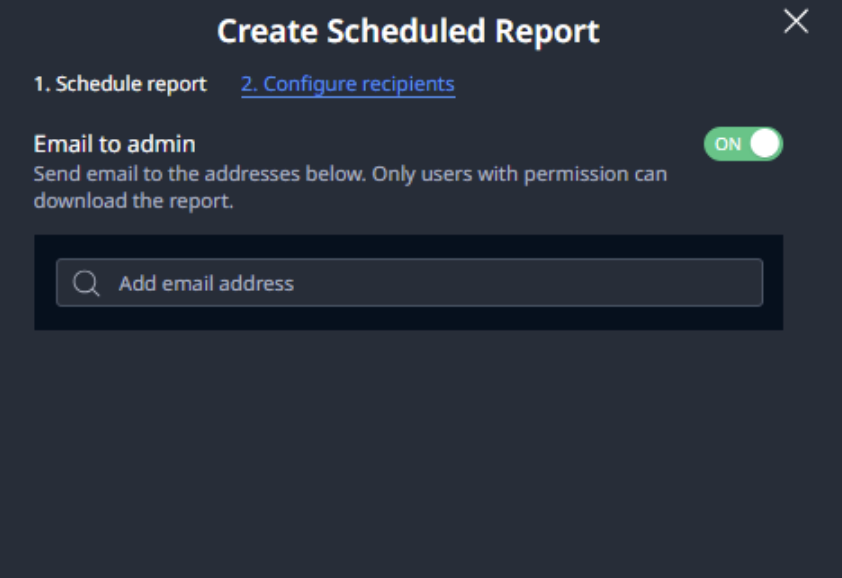

# Usage report per room for Governed channels

Usage report per room displays the total messages sent and received per active chat room during the pre-configured time. This article explains how Usage report per room for Governed channels works and how to configure on the Org Admin portal.  

> **Note:** The Usage report only captures messages and excludes message reaction events.  

---

## How does a Usage report per room work?

The report is sent via email and includes the total messages sent and received by each provisioned user in active client chat rooms over the specified interval (X hours).  

**Example:** If you set the interval as 24 hours, every 24 hours, the system will send an email with a CSV file including the total messages sent and received per provisioned user per active chat room within that 24 hours.  

---

## Fields in the Usage report

| **Fields** | **Description** |
|------------|-----------------|
| **Room** | Room ID, retrieved from the LeapXpert audit log. |
| **RoomName** | The room name of the active chat room. The data is the name for group chats or direct 1-1 chats. |
| **UserName** | The User's first name and last name in the active chat room with clients. |
| **Channel** | The channel(s) of all clients within the chat room including WhatsApp Governed, iMessage Governed, WeChat Miniapp Governed, SMS Governed, Signal Governed and LINE Governed. |
| **Total Messages Received** | All messages including text and file attachments that were sent by clients are counted as the total received messages. Messages sent by other users are not counted as received. |
| **Total Messages Sent** | All messages including text and file attachments that were sent by the provisioned user are counted as the total sent messages. |

---

## Scenarios: How messages are counted

**Scenario 1**  
- **Given:** 1-1 direct chat between a user and a client  
- **When:** The user sent 7 messages, the client sent 8 messages in the chat room  
- **Then:**  
  - Total messages sent = 7  
  - Total messages received = 8  

**Scenario 2**  
- **Given:** A group chat between User 1, User 2 and Client 1, Client 2  
- **When:**  
  - User 1 sent 2 messages  
  - User 2 sent 3 messages  
  - Client 1 sent 0 messages  
  - Client 2 sent 5 messages  
- **Then:**  
  - User 1: Total messages sent = 2; Total messages received = 5  
  - User 2: Total messages sent = 3; Total messages received = 5  

**Scenario 3**  
- **Given:** User 1 sent 2 messages, User 2 sent 3 messages, Client 1 sent 4 messages (then was removed), Client 2 sent 5 messages  
- **Then:**  
  - User 1: Total messages sent = 2; Total messages received = 9  
  - User 2: Total messages sent = 3; Total messages received = 9  

---

## Configure Usage report per room for Governed channel

1. Sign in to your Org Admin portal.  
2. Select **Provisioning > Alerts & Scheduled Reports > Scheduled Reports**.  
3. Click **Create Scheduled Report**.  
4. Fill in the report name, in the **Report type** dropdown, select **Chat usage report by rooms for Governed channels**. 
5. Select the interval (LeapXpert supports following intervals).  
6. Click **Next** to proceed.  
7. Enter recipients' names, then click **Create**.   
You have successfully created a Usage report per room for the Governed channel.  
For more information, also see **Create a report schedule**.  

---

## Limitations

For MCP mode, if a Federal Identity (phone number) is unlinked and re-linked to a different client profile, the following will occur:  
- The room is not included in the report if the re-linked profile is the only client in the room.  
- Messages from that Federal Identity are not counted as "Received by user" if the room contains other clients besides the re-linked profile.  
> **Note:** This applies to both 1-1 chats and group chats.  
