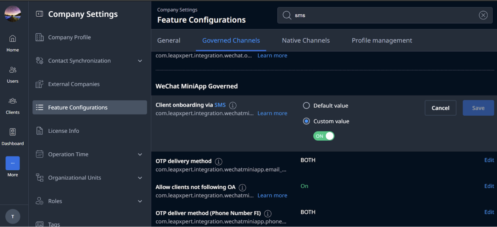
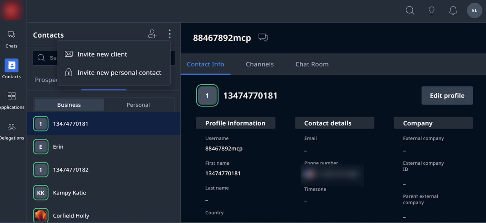
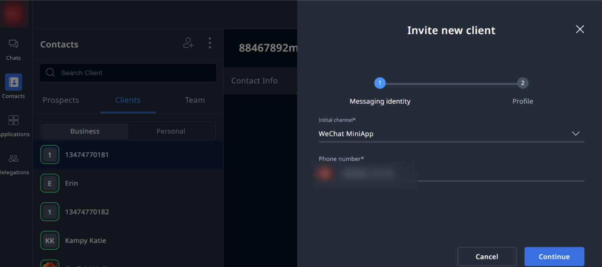
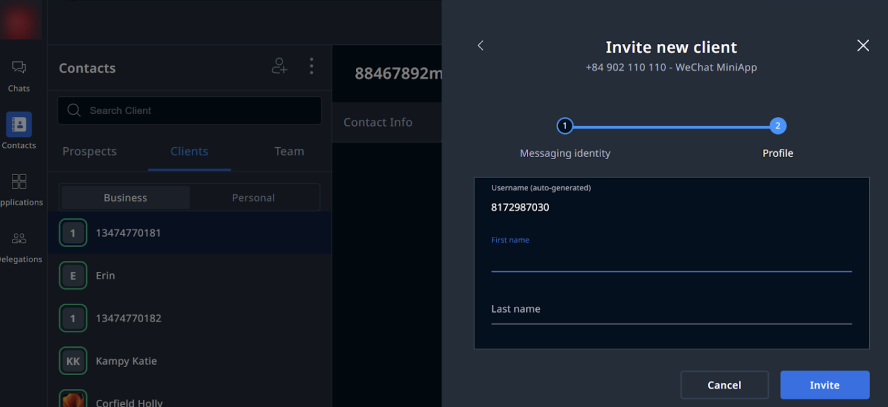
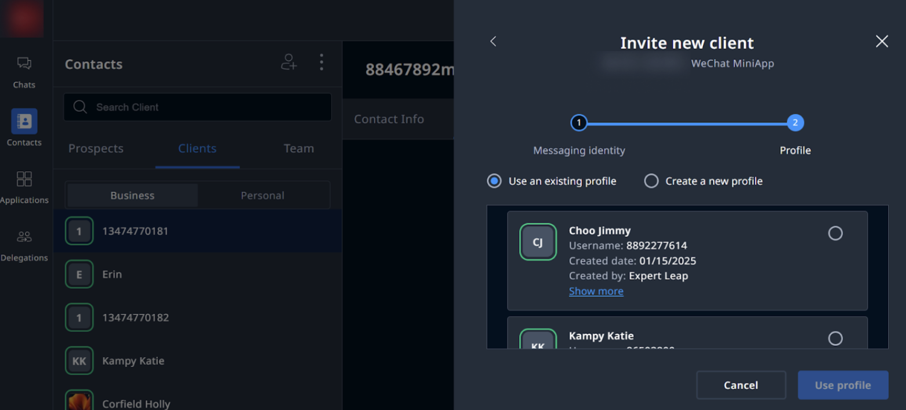
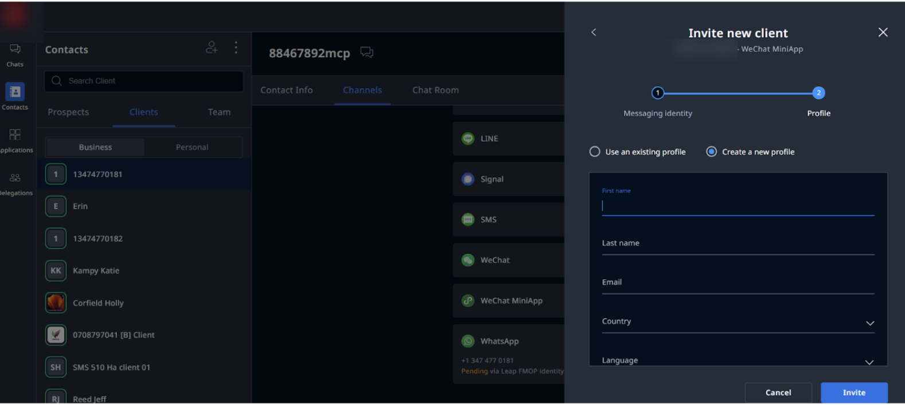
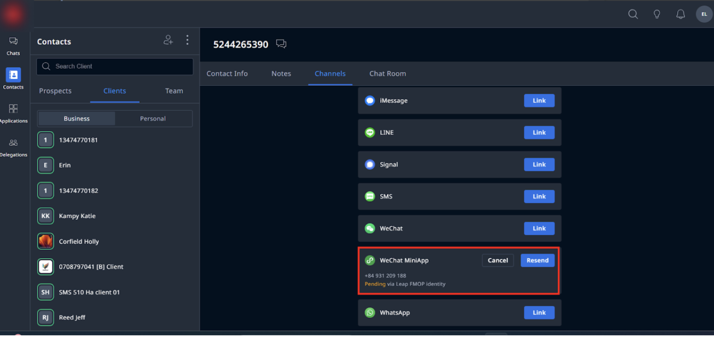
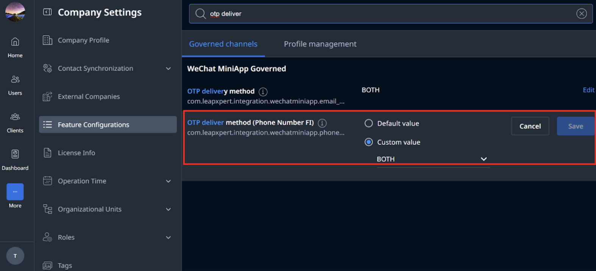

# Configure the client onboarding flow with SMS

This document provides detailed instructions on how to configure the WeChat MiniApp client onboarding flow with SMS.  
**Note:** Please note that this flow is different from the onboarding flow with email.

---

## Before you start
- You are using LeapXpert version 2.6.0 onwards.  
- You have enabled the client onboarding via SMS on the Org Admin portal.  

Steps:  
1. Go to **Company Settings > Feature Configurations > select Governed Channels**.  
2. In the **WeChat MiniApp Governed** section, search for **Client onboarding via SMS**.  
3. Click **Edit > Custom value > toggle to ON**.  
   - The Default value is **OFF** (the client onboarding flow with email).  

---

## Onboard clients with SMS
1. Go to **Leap Work web or mobile app**.  
2. Go to **Contacts**, select **Invite new client**. 
3. In the Invite new client, select **WeChat MiniApp** as the Initial channel.   
4. Type the client’s phone number, then click **Continue**.  
5. For a new profile, enter the client's information and click **Invite**.   
   - Select **Use an existing profile** if the client already has a profile on LeapXpert system or **Create a new profile**.   
   - If you choose **Create a new profile**, enter the client’s:  
     - First and Last name  
     - Email  
     - Country  
     - Language  
     - External company  
     - Tags 
     
6. Click **Invite**.  
7. Go to **Channels** and check the integration status is **Pending**.      

> **Note:**  
> - The OTP will be sent to client via SMS. Please note that from version 2.6.0 onwards, the OTP can be sent to the client’s email/SMS or both depending on the configuration.  
>- In addition, LeapXpert will send OTP messages in the client's language, determined by the country code of the registered phone number.   
>For clients with the **Pending** status, the system sends the OTP to the number. If the phone number does not exist in our system, the system will not send the OTP but still stays at the OTP screen.  

---

## Configure the OTP delivery method via Email
**Note:** This enhancement is only available from version 2.6.0 onwards.  

1. Go to **Company Settings > Feature Configurations > select Governed Channels**.  
2. In the **WeChat MiniApp Governed** section, search for **OTP delivery method (Phone Number FI)**.   
3. Click **Edit > Custom value**.  
4. Select an option from the dropdown list:  
   - **Both:** OTP is delivered via both Email and SMS.  
   - **Email:** OTP is delivered via Email only.  
   - **SMS:** OTP is delivered via SMS only.  
   - The Default value is **Both**.  
5. Once done, click **Save**.  
