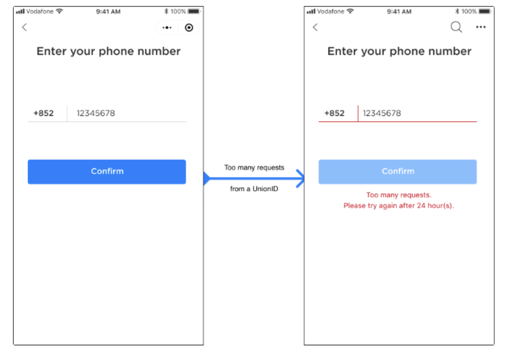
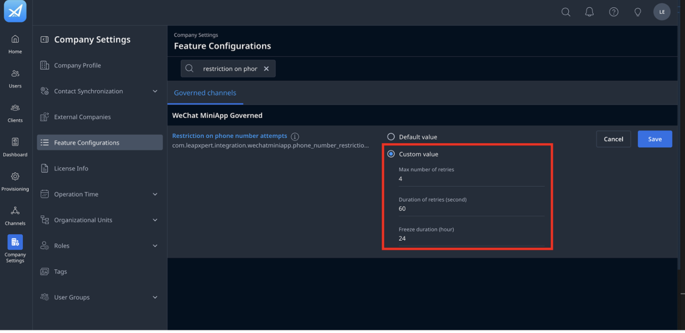
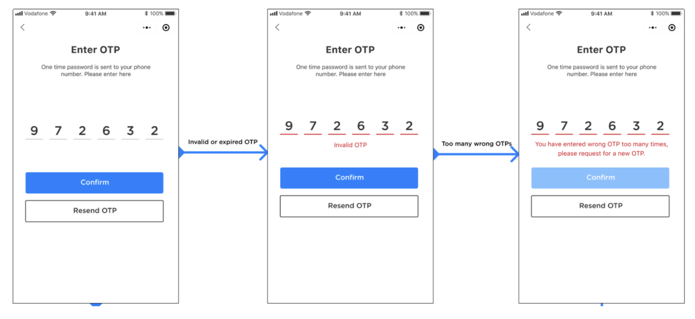
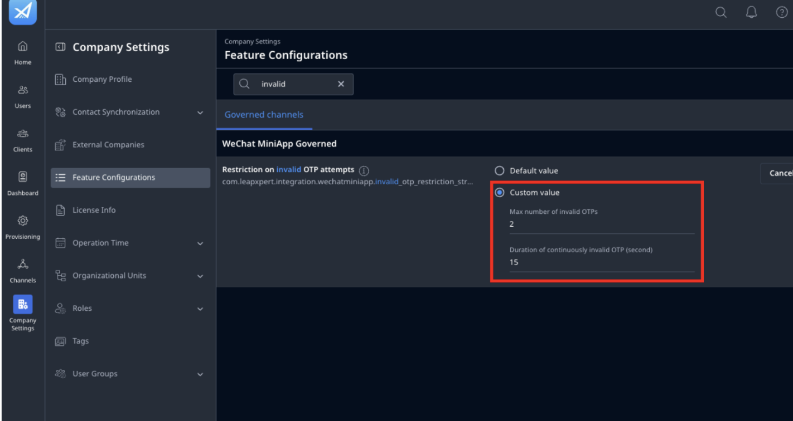
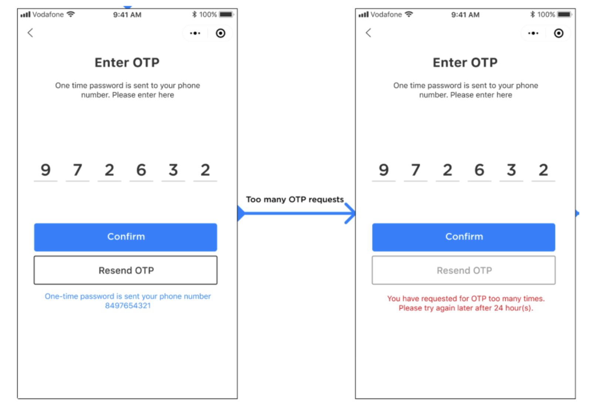
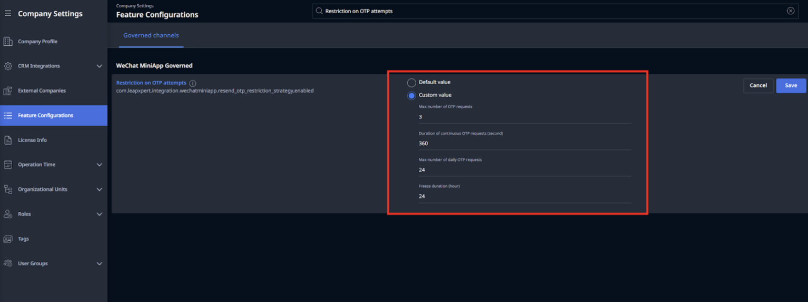

# Configuring Phone Number and OTP Input Restrictions in the WeChat MiniApp Onboarding Flow

This guide explains how to configure restrictions on phone number and OTP inputs in the WeChat MiniApp onboarding flow.

---

## Before you start
- You are using the LeapXpert version 1.21.1 onwards.  
- The company admin has permission to manage Feature Configurations.  
- You have walked through the **Configure the client onboarding flow with SMS** (internal link).  

---

## Phone Number Entry Constraints

### Behavior
If a client enters an incorrect phone number **A** times within **B** seconds, they will be temporarily locked out for **C** hour(s).   

### Configuration
To configure the maximum number of invalid phone number attempts, do as follows:  

1. Sign in to the **Organization Admin portal**.  
2. Go to **Company Settings > Feature Configurations > Governed channels**.  
3. Search **"Restrictions on phone number attempts"**.    
4. Click **Edit** and choose one of the following:  
   - **Default value**: apply the pre-defined configuration by LeapXpert.  
   - **Custom value** and enter the following values:  
     - **A**. Maximum number of retries.  
     - **B**. Duration of retries (seconds).  
     - **C**. Freeze duration (hour).  
5. Once done, click **Save**.  

You have successfully configured the phone number entry constraints.  

>**Note:** If above fields are empty, it means there are no restrictions.  

---

## OTP Input Constraints

### Behavior
If a client enters an incorrect OTP **X** times within **Y** seconds, the OTP becomes invalid. The client must then request a new OTP.     

### Configuration
To configure the maximum number of invalid OTP inputs, do as follows:  

1. Sign in to the **Organization Admin portal**.  
2. Go to **Company Settings > Feature Configurations > Governed channels**.  
3. Search the keyword **"invalid OTP"** in the WeChat MiniApp Governed section.  
4. Click **Edit** and choose one of the following:  
   - **Default value**: apply the pre-defined configuration by LeapXpert.  
   - **Custom value** and enter the following values:  
     - **X**. Max number of invalid OTPs.  
     - **Y**. Duration of continuously invalid OTP (second).       
5. Once done, click **Save**.  

>**Note:** Invalid OTPs include wrong/expired OTPs.  

You have successfully configured the maximum number of invalid OTP inputs.  

---

## OTP Resend Constraints

### Behavior
If a client taps **Resend OTP** more than **C** times within **D** minutes, they will be blocked from requesting new OTPs for **E** hour(s). 
Additionally, there is a daily limit on the total number of OTP resends (**F**).  

### Configuration
To configure the maximum number of allowed OTP resend requests, follow these steps:  

1. Sign in to the **Organization Admin portal**.  
2. Go to **Company Settings > Feature Configurations > Governed channels**.  
3. Search **"Restriction on OTP attempts"** in the WeChat MiniApp Governed section.  
4. Click **Edit** and choose one of the following:  
   - **Default value**: apply the pre-defined configuration by LeapXpert.  
   - **Custom value** and enter the following values:  
     - **C**. Max number of OTP requests.  
     - **D**. Duration of continuous OTP requests (second).  
     - **E**. Freeze duration (hour).  
     - **F**. Max number of daily OTP requests.  
5. Once finished, click **Save**.  

You have successfully configured the maximum number of allowed OTP resend requests.  
