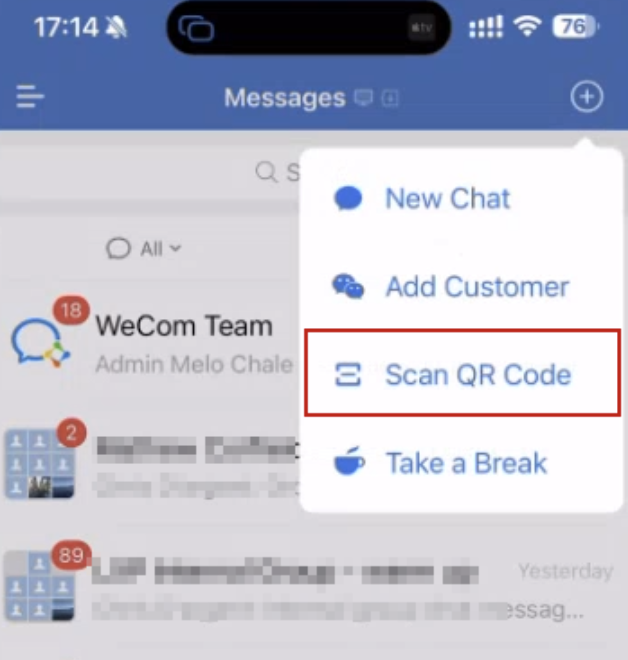
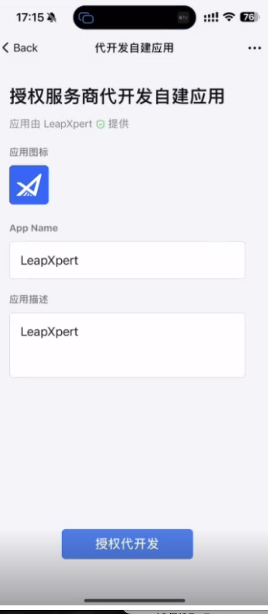
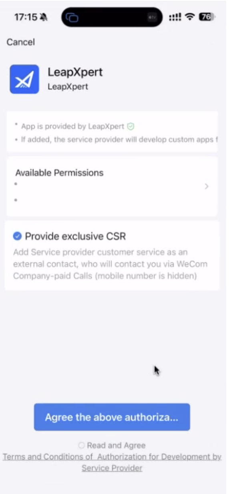
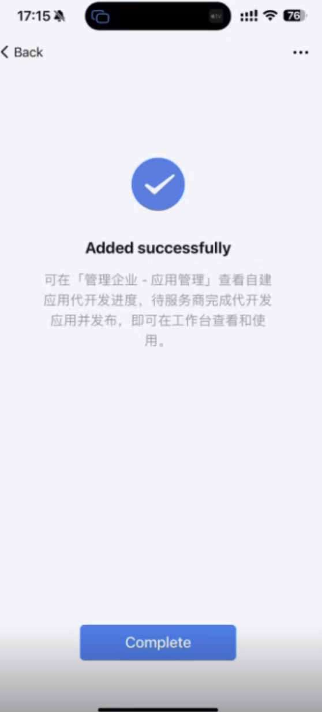
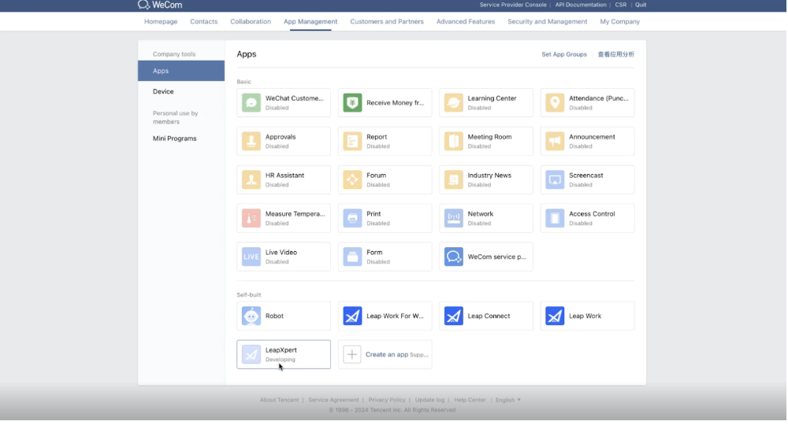
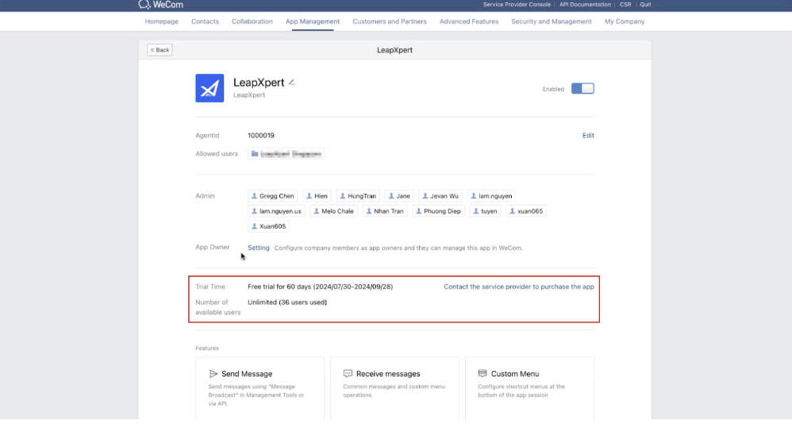
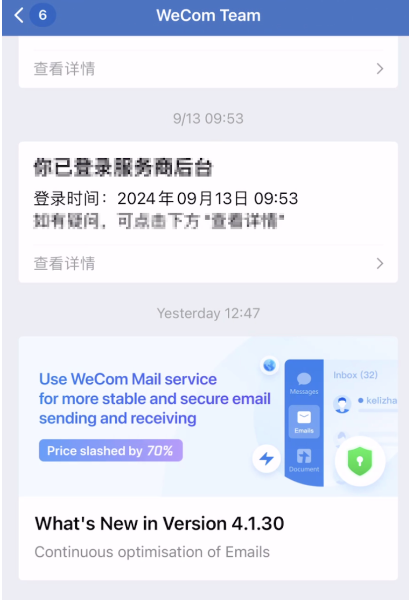
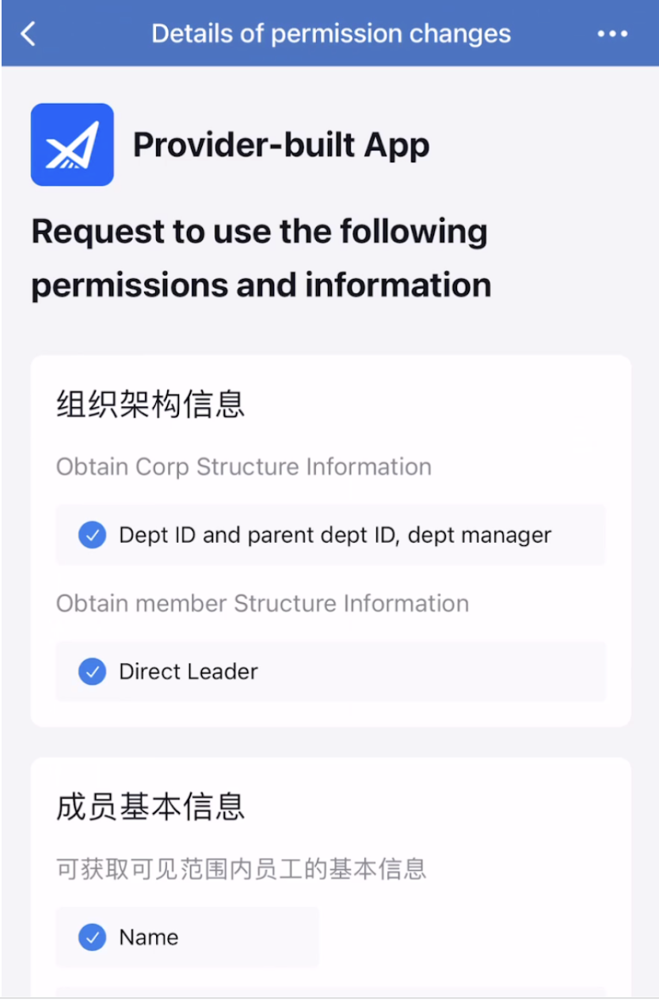
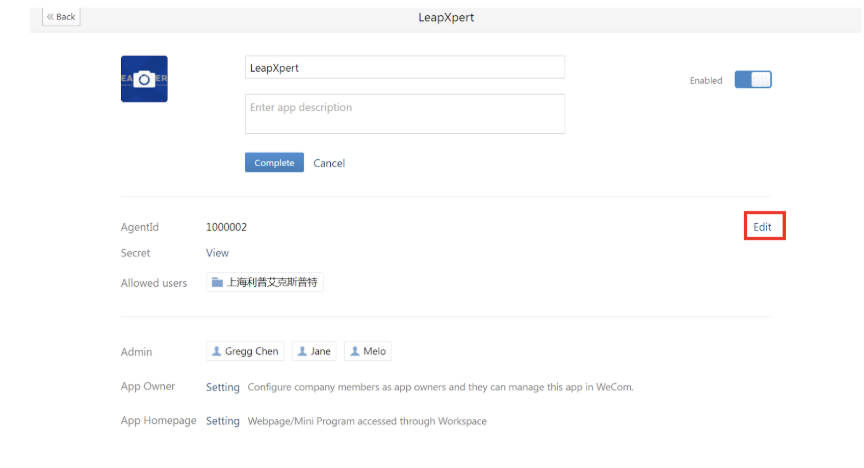
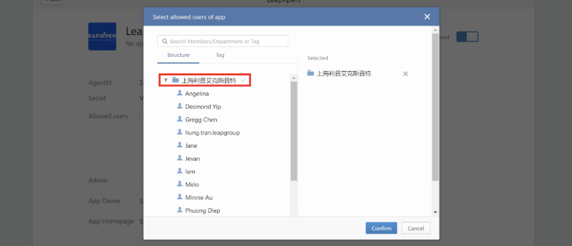

# Configure Provider-built app for WeCom Native integration

Under Tencent's new policy, companies must obtain an **ICP license**—issued to organizations in mainland China—in order to retrieve client or group chat details in LeapXpert's message archiving system. Without this license, the details will appear as anonymous.  

For overseas companies without the ICP license, LeapXpert introduces the **Provider-built app** with our configured ICP license to help you call API and fully get client/group chat information.  

This article helps companies' admins configure the Provider-built app for WeCom Native integration.  

---

## Before you start
- You are using the LeapXpert version **2.4.0 onwards**.  
- Ensure you can access the WeCom app on your mobile and [WeCom Admin portal](https://work.weixin.qq.com/).  

---

## Configure the Provider-built app

### 1. Scan the QR code & install the app for WeCom Enterprise account
1. On your **WeCom app**, scan the **QR Code** provided by LeapXpert.  
2. Tap the **blue button** to grant access to LeapXpert's Provider-built app.   
3. Tap the **Agree** button to confirm. At this time, the Provider-built app has no permissions.   
4. Tap **Complete**.   
5. Log in to your **WeCom admin portal** and go to **App Management**. The Provider-built app appears in your Enterprise account with the **Developing** status.   
6. Inform LeapXpert to activate the application. Once LeapXpert has activated the app, click on the app and notice the status is **Enabled**. At this step, LeapXpert also adds extra permissions.    

---

### 2. Approve the permissions after LeapXpert completes the setup
1. After LeapXpert selects the permissions in our system, you will be notified about the changes in the **WeCom Team chatbox**.  
2. You need to approve the changes in permissions to get users' & clients' information.  
3. Click **View Details** to enter the details page.    
4. The admin can review the new list of permissions for the Provider-built app and click **Agree** to approve the request.     
5. The admin can view details, and there is an additional section related to **Trial Period/App**, which is different from the Self-built app.  

---

### 3. Select the provisioned user
1. Click **Edit** to select the **Allowed users**.      

  > **Note:** This step is important to make sure your WeCom AM users have access to the Provider-built app.  

2. It does not matter if the user has the Interworking license or not, click the company name to select all members of the company.   
3. Once done, the Provider-built app starts getting user & client information when synchronizing WeCom conversations.  
