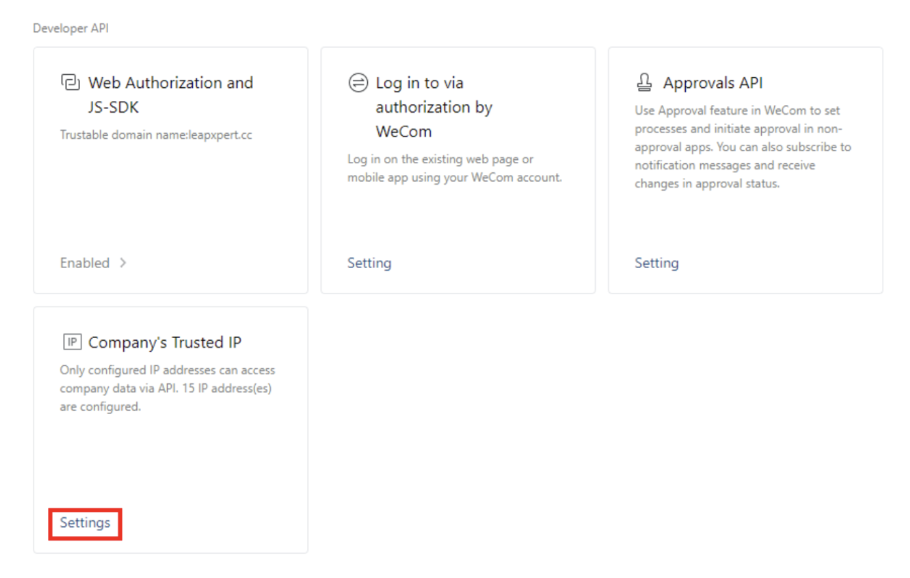

# Configure Trusted IP for the Self-built app

Overseas companies cannot access client information, such as names and avatars, from the API because Tencent's new policy restricts companies without an ICP license from calling the Clients API. All overseas companies do not possess an ICP license.  
This guide explains how to configure the trusted IP for Self-built app, so you can call the API to retrieve fully clients & group chat information.

---

## Before you start
- You are using the LeapXpert version 2.4.0 onwards.  
- Ensure you have an ICP Filling record on the website [https://beian.miit.gov.cn/](https://beian.miit.gov.cn/).  
  - If you have registered the entity, you will be able to see all of the information while searching the company's domain.  
  - Check this guide to register the ICP Filling. 
- The company registered in the ICP Filing record must be the same company you are logging in as.  

---

## Configure the Trusted Domain
To configure the Trusted Domain, do as follows:

1. Access the WeCom admin portal at [https://work.weixin.qq.com/](https://work.weixin.qq.com/)   
 
2. Open your WeCom mobile app and scan the QR code.  
3. From the dashboard, select **App Management**.   
4. Scroll down to **Self-built** section and select an available app. In this sample, we select **LeapXpert app**.     
5. Select **Enabled** in the **Web Authorization and JS-SDK card**.    
6. Enter the domain name in the **Trustable Domain Names** field.  
   - In this sample, we use **leapxpert.cc** because this domain already has the ICP Filling record.     
7. Select **OK**.      

>⚠️ If you input an unregistered domain name or the company you are logging in does not match what is registered on [https://beian.miit.gov.cn/](https://beian.miit.gov.cn/), you will receive an error message.  
- In this example, because **leapxpert.com** lacks an ICP Filling record, you are unable to set a trusted domain name.   
8. After setting the trusted domain name, select **Settings** on **Company’s Trusted IP** card.   
9. Enter your desired IP addresses and select **OK**.    
   - Users can input the IP with the format: `X.X.X.X` separated by commas. For example:  
     ```
     123.123.123.123;111.111.11.11;...
     ```  
   > Note: This is just a sample fake IPs.  

You have successfully configured the Trusted Domain name to input the IP for Self-built app.
