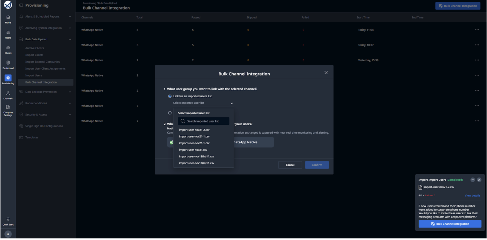
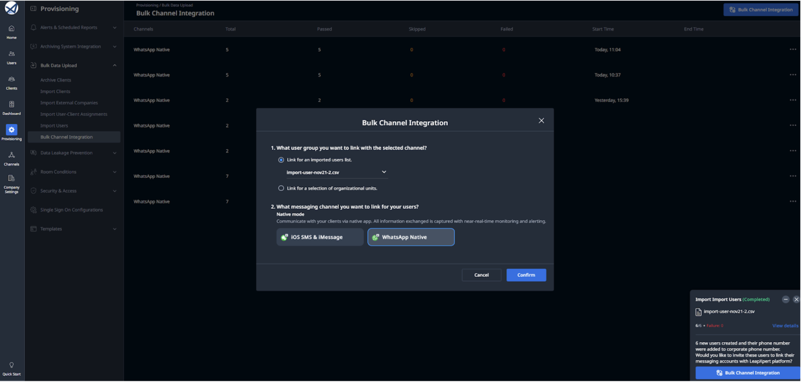
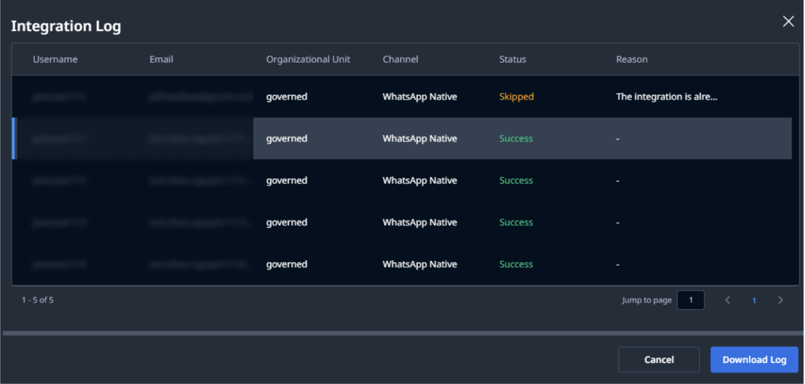
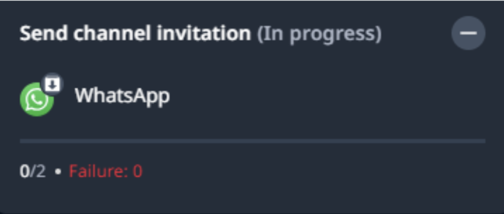

# Bulk User Onboarding to WhatsApp Native

This document provides step-by-step instructions to help you onboard users in bulk to WhatsApp Native.

---

## Before you start
- You are using the LeapXpert version 2.5.0 onwards.  
- You have enabled the following permissions:  
  - **Bulk Integrate Users** - Admin can create, view history and logs (Administrative).  
  - **Bulk Import Users** - View import history & details (Administrative).  
  - **View list of Org Units** (Administrative).  
- You have enabled the WhatsApp Native archived on the Org Admin portal. (`com.leapxpert.whatsapp.archived.channel.enabled`)  
- You need to set the maximum number of users allowed per bulk user onboarding.  
  - To configure this, go to **Company Settings > Feature Configurations** and search for *"Define maximum number of records (users) per Bulk Integration run"*.   

>**Note:**  
>- The default value is **100**, but you can configure it to any number you prefer.  
>- The bulk import cannot proceed if the number of users you want to import exceeds this limit. In this case, you will see an error message.  

---

## Bulk user onboarding to WhatsApp Native - step-by-step guidance

### For admins
To send bulk integration via email for users, do as follows:

1. Sign in to the **Organization Admin portal**.  
2. Go to **Provisioning > Import Users**. 
3. Select **Import File** and upload the `.csv` file containing the list of users.  
4. Browse file and toggle the button to add the user's phone number to the **Corporate Phone Number list**.   
5. Once done, click **Import**.  
6. Before conducting the Bulk Channel Integration, check if users have been added to the Corporate Phone Number.  
   - If users are successfully added, you can proceed to the bulk integration.  
   - Otherwise, inspect the issue and re-add users to the Corporate Phone Number.    
7. Access the **Bulk Channel Integration** by option 1 or 2:  
   - **Option 1**: Click *Bulk Channel Integration* in the prompt.  
   - **Option 2**: Go to **Provisioning > Bulk Channel Integration > click Bulk Channel Integration button**.  

---

#### Option 1: Start the bulk onboarding process right after the Bulk Import
8.1 The recently imported `.csv` file is automatically selected. Select the channel **"WhatsApp"** and click **Confirm**.  
9.1 You will then see a prompt notifying you of the number of users to whom the invitation email will be sent. Click **Send email** to confirm.   
10.1 Once the process begins, you'll receive a summary of the results, showing:  
   - How many users received the invitation.  
   - How many were skipped.  
   - How many failed.  

- To view the status of the email sending, click **View details**.  
- To view each member's integration status, click **View Corporate Phone Number**. You will be directed to the Corporate Phone Number page.    

---

#### Option 2: Start the Bulk onboarding anytime from the Bulk Channel Integration page
8.2 Navigate to the **Corporate Phone Number** and check if users are added or not.     
9.2 Go to **Provisioning > Bulk Channel Integration > click Bulk Channel Integration button**.     
10.2 You can choose the `.csv` file or the users list in the organizational units (OU).  
   - **10.2.1** If you choose *"Link for an imported users list"*, select the `.csv` file you have recently uploaded from previous steps in the dropdown list.   
   - **10.2.2** If you choose *"Only link for a selection of organizational units"*, select the OU which contains the users you want to send the bulk integration email.   

  > **Note:** Ensure that the selected OU includes the role with the necessary permissions to support the bulk integration process.  

11.2 Select **"WhatsApp Native"** and click **Confirm**.    
12.2 You will then see a prompt notifying you of the number of users to whom the invitation email will be sent. Click **Send email** to confirm.     
13.2 Once the process begins, you'll receive a summary of the results, showing:  
   - How many users received the invitation.  
   - How many were skipped.  
   - How many failed.  

    
- To view the invitation email sending, click **View details**.  
- To view each member's integration status, click **View Corporate Phone Number**. You will be directed to the Corporate Phone Number page.      

---

### (*) Integration Log
The admin can view the **Integration Log** of the Bulk Integration anytime from the Org Admin portal.  

To view the Integration Log, do as follows:  
1. From the Org Admin portal, go to **Provisioning > Bulk Data Upload > Bulk Channel Integration**.  
2. Click menu `"..."` of any integration items.  
3. Click **View Integration Log**.       

In some cases, users cannot receive the invitation. When this happens, the integration record will display a status of **Failed** or **Skipped**, along with a detailed explanation of the issue.  

- A user will **fail** to receive an invitation in the following cases:  
  - The user is archived or has not been created.  
  - The user's email address does not exist.  
  - The system cannot find the user's corporate phone number.  

- A user will be **skipped** in this case:  
  - The user is already linked. 

       

---

### For AM users
1. The AM user will receive the invitation email. Click **Link Your WhatsApp Account** or copy the link.     
2. Open your WhatsApp and scan the QR code.     
3. Once you finish, the screen will change as below.  

You have successfully completed the bulk integration via email to WhatsApp Native.  

---

## Limitations
- The user cannot stop the bulk user onboarding process.  
- A company is allowed to conduct the bulk user onboarding **once at a time**.  
- If someone else in your company is also conducting the bulk user onboarding, your process will be **pending** until they complete the bulk integration.  
