# Onboard a client profile with a WhatsApp official account pool (inbound flow)

From LeapXpert version 2.4.1 onwards, we have supported the MCP mode for client profile onboarding with a WhatsApp official account pool. This flow is different from **Onboard a prospect with a WhatsApp official account pool**.  

This article provides a detailed instruction to help you onboard a client profile to the WhatsApp official account pool (also known as the inbound flow).  

---

## Before you start
- The company needs to contact LeapXpert to comprehensively configure this inbound flow.  
- Your company admin has configured a WhatsApp official account pool.  
- The admin has enabled this feature configuration: **Auto promotion of NVC (non-verified client)**. However, currently we don't use the NVC term, instead, we refer to this as *"client profile"*. 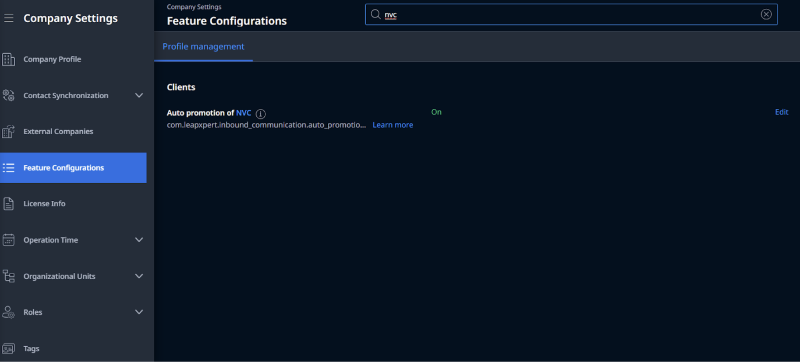 
- You need to set up an extension for the user. Otherwise, you cannot generate the QR code for that user.  
  - To set up the extension, refer to **Manage extensions**.  

The company provides the client following information:  
- **Option 1**: User's QR code.  
- **Option 2**: Official Account number & Extension. If you choose option 1, there is no need to provide this information.  

- **Official Account number**: the primary WhatsApp official account number of your company. This is for clients to contact.  
- **Extension**: a unique string to identify the company employee to connect to, for example, `#michael`.  
  - You need to contact your company admin to follow this instruction to add an extension: **Manage extensions**.  

>**Note:** The extension is essential for both options mentioned above.  

---

## Understand the definition of primary accounts and secondary accounts
For your reference, see also:  
- *Official account pools* (internal link)
- *Onboard a prospect with a WhatsApp official account pool* (internal link)

---

## Onboard a client profile to WhatsApp official account pool: step-by-step instructions

### 1. The client sends a request
The client sends a request by two approaches:  
- Sending a message to the WhatsApp primary number with the extension.  
- Scanning the QR code shared by the company employees (AM users).  

---

### 2. System checks for users
- If there is a user that matches the extension, search for any existing 1-1 chat rooms.  
- If the user is not found, the system sends a *"Not Found"* message, and the process ends.  

---

### 3. Check for existing chat rooms
- If an existing 1:1 chat room with the user is active, a reminder message is sent to that room.  
- If no active chat room exists, the system looks for a visible client profile (CP).  

---

### 4. Finding a visible client profile
- If a CP with a phone number exists and there is only 1 client profile assigned to the user, the system checks if any secondary phone number is available.  
- If there are many client profiles, the system picks 1 client profile randomly.  
- If no CP is found, the system creates a new client profile.  

---

### 5. Secondary number checking
- If a secondary number is available, a chat room is created, and an invitation is sent.  
- If a secondary number is unavailable, an error message is sent via the Primary number.  

---

### 6. Complete
- A message with user info is sent.  
- The process ends with a user assigned to the client profile, and a chat room is activated.  
 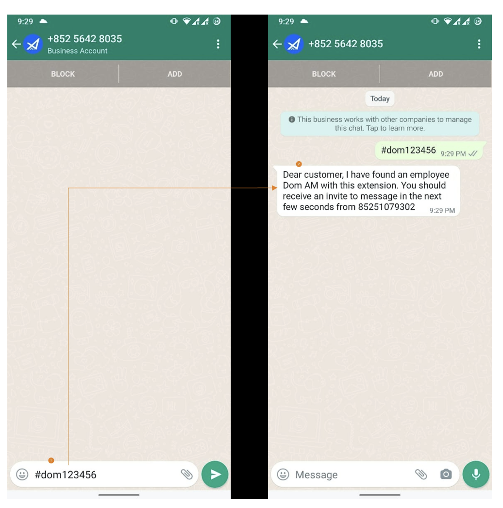 
---
### Special cases
- If the client enters a text **without the extension**, they will receive an automatic reply. 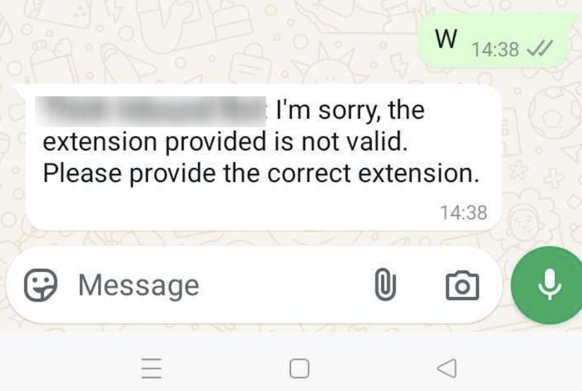  
- If the client enters the **incorrect extension**, they will receive an error message. 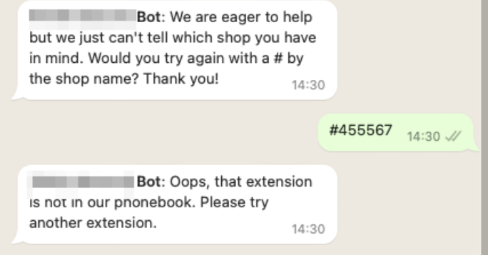 

---

## Share the QR code with the client (for AM users)

AM users refer to this section to know how to share the QR code with the client via **Leap Work web**, **Leap Work mobile**, and **Leap Work for Teams**.  

---

### 1. Leap Work web
To get the QR code on Leap Work web, do as follows:  
1. Sign in to the **Leap Work web**, go to **Profile**, and click the **QR code icon**. 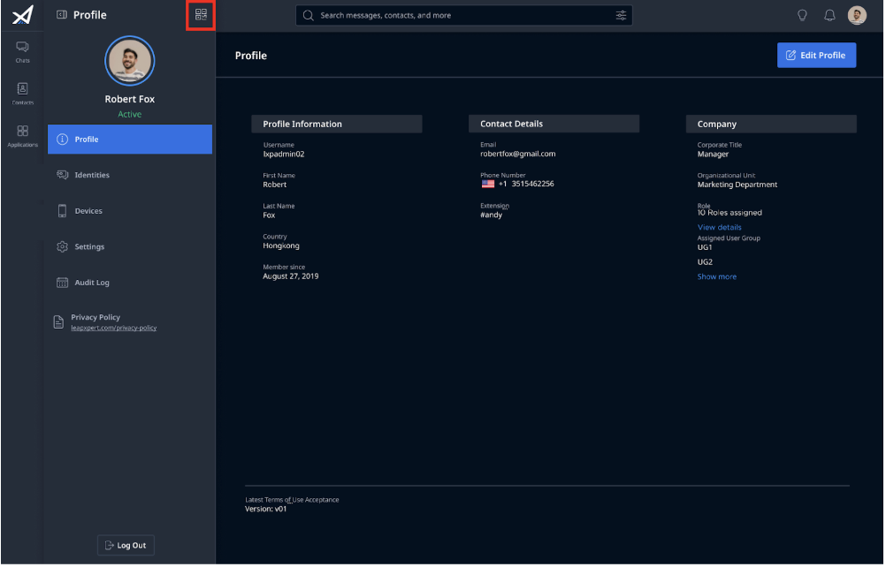 
2. The client uses WhatsApp to scan the QR code to initiate the conversation with the user. 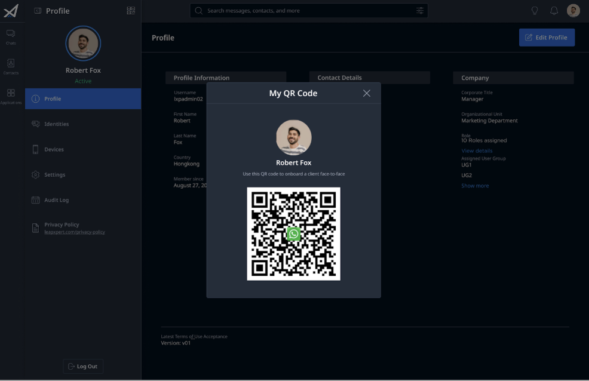  

> **Note:**  
> - If you haven't had an extension, you cannot get the QR code. Please contact your company admin to follow this instruction to add an extension.  
- Once the QR code appears, share it with a client.  
- The client uses WhatsApp to scan the QR code to start the conversation with the user. 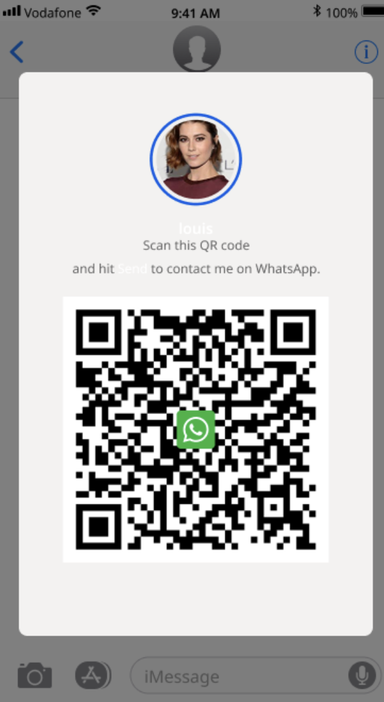   
  - If there is no extension, the user cannot see the QR code on Leap Work.  
  - If there is an issue with the WhatsApp Business Account, you will see the following screen:  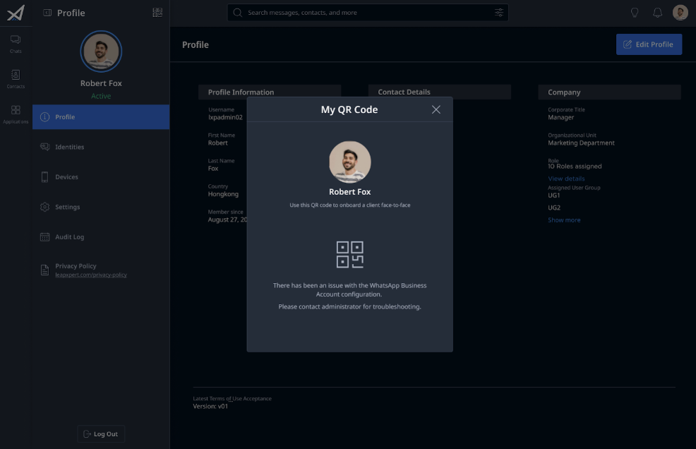 

---

### 2. Leap Work mobile
To get the QR code on Leap Work mobile, do as follows:  
1. Sign in to the **Leap Work mobile**, go to the **profile screen**, and click the **QR code**.  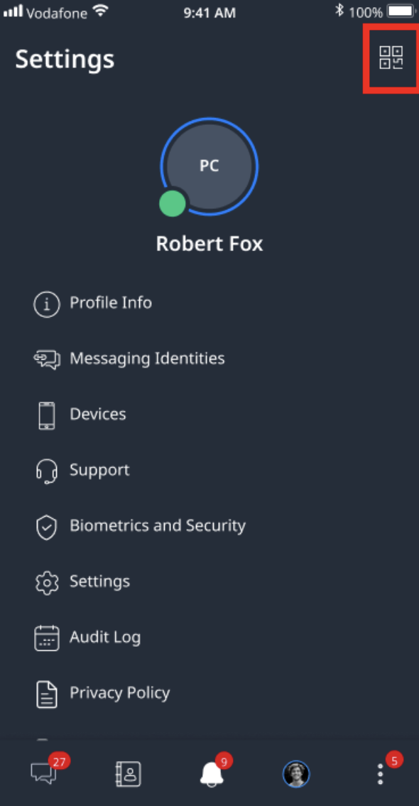 
2. Once the QR code appears, share it with a client. 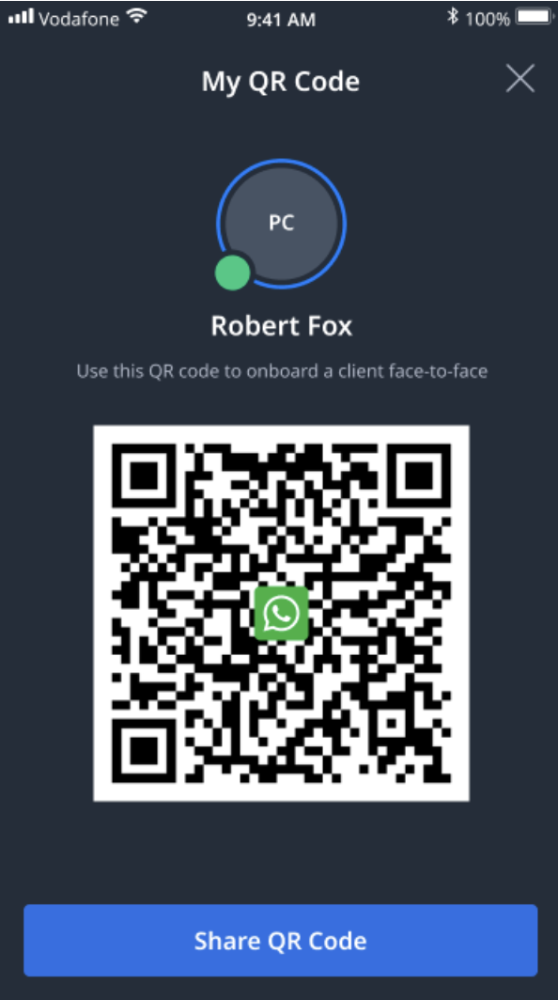
   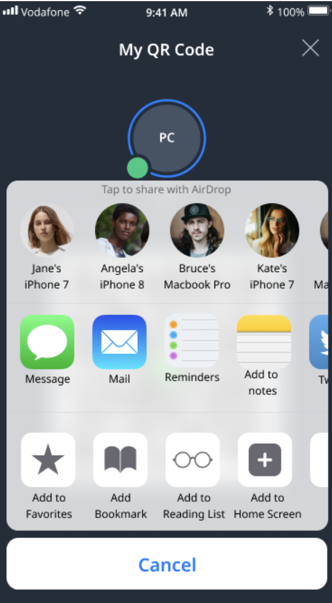  
3. The client uses WhatsApp to scan the QR code to start the conversation with the User.  

> **Note:**  
>- If there is no extension, the user cannot see the QR code on Leap Work mobile.  
>- If there is an issue with the WhatsApp Business Account, you will see the following screen.  

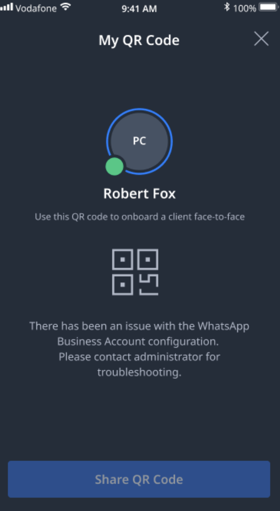  
---

### 3. Leap Work for Teams
To get the QR code on Leap Work for Teams, do as follows:  
1. Sign in to the **Leap Work for Teams**, go to **Profile**, and click the **QR code**. 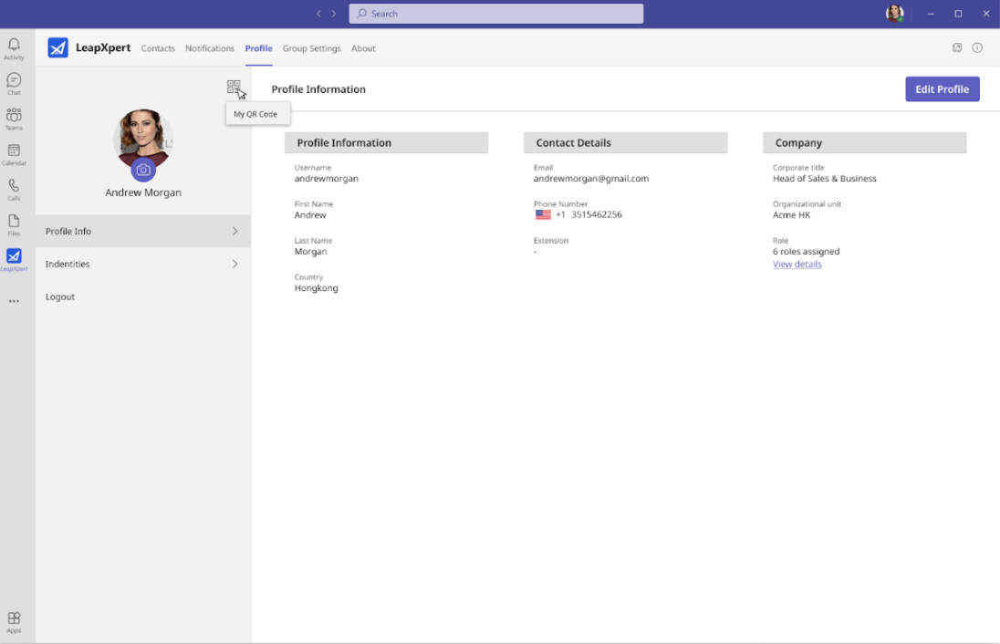  
2. Once the QR code appears, share it with a client.  
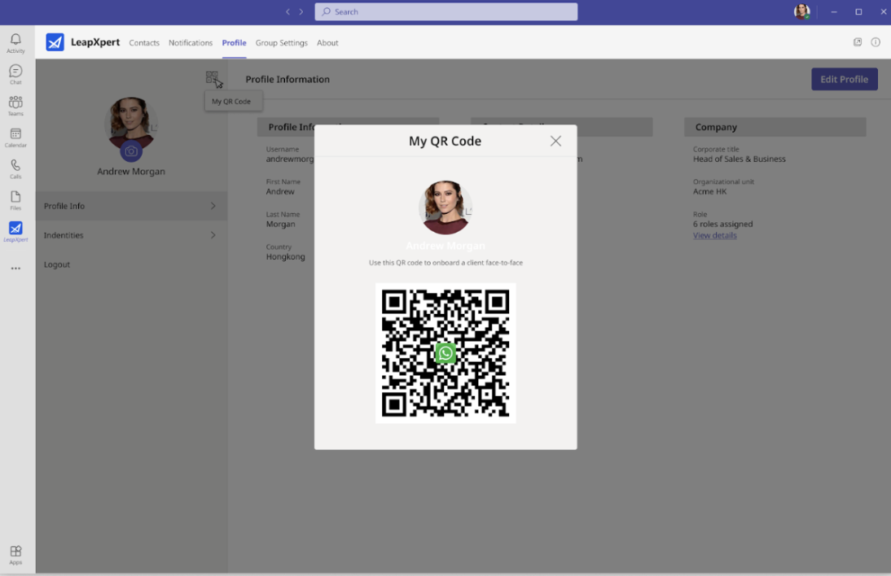  
>**Note:**  
>- If there is no extension, the user cannot see the QR code on Leap Work.  
>- If there is an issue with the WhatsApp Business Account, you will see the following screen.

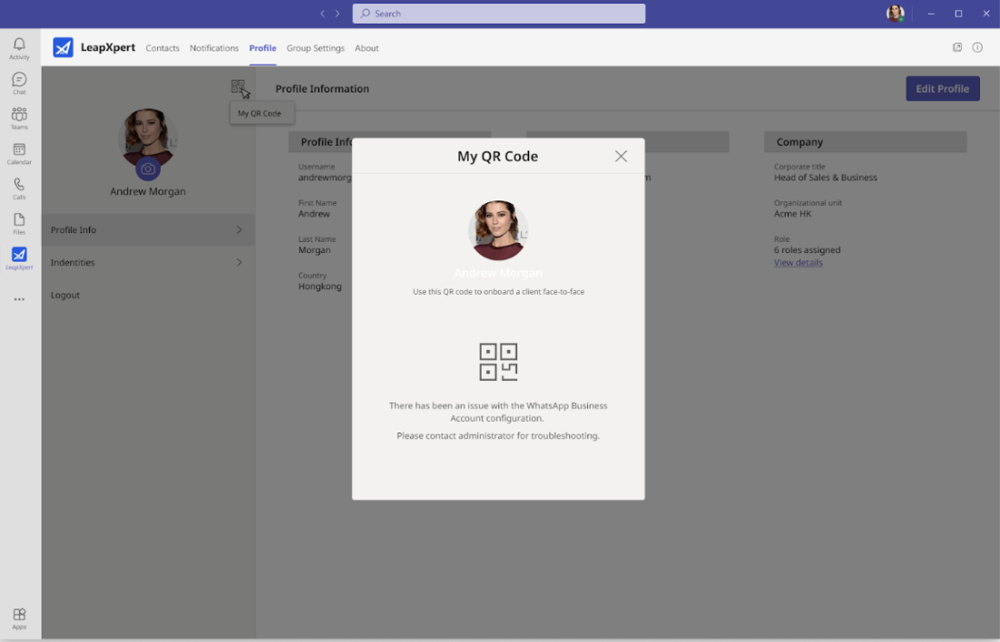
